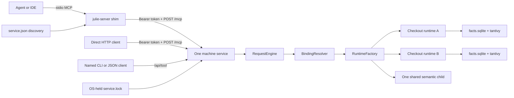

# Julie v8 architecture audit

**Audited:** 2026-09-11
**Julie:** `deployment-story` at `259a40d60e8395839401b9e506438d7287ecd4c3` before audit edits
**Plugin:** `v8-deployment` at `1dec280282d51df3446c6fb493b8b529713077c2` before audit edits

## Architecture

The MCP transport is stateless: the service does not retain a client session or
derive a checkout from the shim process. The indexes are intentionally durable.
`registry.db`, `indexes/<id>/facts.sqlite`, and `indexes/<id>/tantivy/`
survive client disconnects and service restarts.

Search, navigation, and editing calls must carry `workspace` as an absolute
path or registered workspace ID. Register a checkout with
`manage_workspace(operation="open", path="/absolute/project")`. Checkout-targeted
`manage_workspace` operations use `path` or `workspace_id` as their schema
allows. Global `list` and `status` need neither selector. The stdio shim and `/api/<tool>` both feed the same
`RequestEngine`, so launch directory does not change routing.

## Findings

| Finding | Resolution |
|---|---|
| HTTP compatibility fabricated missing required headers and skipped Origin validation | Removed header fabrication and enabled Origin checks; focused verification recorded by the lead |
| Concurrent clients could race service startup | Fixed with the single OS-held `service.lock` acquisition path |
| The shim derived workspace from `cwd` or `JULIE_WORKSPACE`, so plugin launches could index the plugin | Removed; workspace is explicit on each scoped call |
| macOS packaging assumed GNU `sha256sum` | Added the native `shasum -a 256` fallback and a PATH-isolated behavioral test |
| Repacking left the sidecar manifest pointing at removed or renamed files | Preserved its files and renamed it `sidecar-package-manifest.json` to state its scope |
| `sync-plugin` guessed a sibling from the linked checkout path | Resolve the Git common directory, with a normal-checkout fallback |
| A release tag could disagree with `Cargo.toml` or omit its release-notes file | Release preflight now rejects either mismatch before platform builds; the checked-in v8 notes are substantive |
| Codex and Antigravity plugin MCP declarations were removed only because of cwd routing | Restored root `mcp.json` and `mcp_config.json`; their launcher cwd is now irrelevant |

## Evidence

- MCP 2026-07-28 removes protocol-level sessions; application state may still
  persist: [MCP 2026-07-28 announcement](https://blog.modelcontextprotocol.io/posts/2026-07-28/).
- Streamable HTTP requires Origin validation, localhost binding, and
  authentication: [MCP 2026-07-28 transport specification](https://modelcontextprotocol.io/specification/2026-07-28/basic/transports/streamable-http).
- Agent Plugins v1 discovers MCP servers from root `mcp.json` and expands
  `${PLUGIN_ROOT}` in arguments: [Agent Plugins specification](https://agent-plugins.org/specification).
- Antigravity plugins discover root `mcp_config.json`:
  [Antigravity plugin documentation](https://antigravity.google/docs/cli/plugins/).
- OpenCode 1.x accepts `mcp.<name>`, command arrays, `enabled`, and
  `environment`: [OpenCode MCP documentation](https://opencode.ai/docs/mcp-servers/).
- OpenAI's current Codex documentation describes plugins as reusable
  capabilities for Codex: [OpenAI Docs](https://learn.chatgpt.com/docs/build-plugins).

Focused checks completed during the audit:

- Linked worktree plugin-root regression: pass.
- PATH-isolated macOS checksum fallback and archive-manifest regression: pass.
- Release input contract: pass.
- Agent-instruction contract and 2 KB budget: pass at 1,973 bytes.
- Plugin Node suite: 22 of 22 pass.
- Linux staged archive inspection: server, sidecar, and required shared
  libraries present.
- Combined `cargo build` and `cargo fmt --check`: pass.
- Fresh isolated debug binary: two concurrent starts against one `JULIE_HOME`
  left one surviving owned service PID.
- A shim launched from a foreign directory rejected a missing selector with
  `WORKSPACE_REQUIRED` and created no `.julie` directory there.
- Two small checkouts received distinct IDs. Search routed checkout A by path
  and checkout B by ID. `edit_file` by B's ID changed only B; A and the
  foreign directory were untouched. Fixture processes were cleaned up.
- Absolute-file-path edit/index-freshness probe: pass. Renaming `second_probe`
  to `renamed_probe` became searchable after indexing; facts retained only the
  relative `src/lib.rs` path and the old symbol disappeared.
- Final sequential gate: `cargo fmt --check`, `cargo clippy --workspace --all-targets`,
  and `cargo xtask test full` all exited 0. Full ran five of five commands in
  33.4 seconds: 2,221 of 2,221 dev tests, 13 of 13 ignored CLI tests, and 69 of
  69 dogfood tests. The fixture-only `exec sleep` descendant was corrected;
  the final run reported no leak.
- Clippy retained existing warnings; the newly introduced style warning was fixed.
- Lead plugin suite rerun: 22 of 22 pass.

## Release boundary

Final integration verification passed on the working tree at `259a40d6`.
Existing live-index duplicate paths were not reproduced with the fresh binary,
so this audit makes no definitive attribution for them. No native macOS or Windows
archive was built in this audit, and no fresh Codex or Antigravity plugin install
was performed. The existing untracked Linux plugin archive predates these fixes
and must not be treated as the release candidate.

Existing operational follow-ups remain: open checkout runtimes have no memory
bound, and a partial vector backfill does not resume after restart. This audit
covered transport, workspace routing, process startup, installation, packaging,
and release mechanics; it was not an exhaustive dashboard or search-quality
audit.
